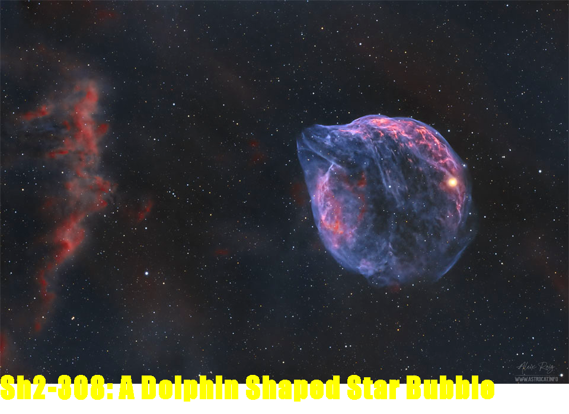

# Imersão Alura Java ☕
## Aula 1
Realizado um request para obter uma amostra de filmes e exibi-los no terminal

## Aula 2
Utilizando dados dos filmes criando uma imagem personalizada e salvar em disco para compartilhamento.

## Aula 3
Consumindo dados da API da nasa, refatorando o código e fazendo uso de abstrações.
### Desafios
- [ ] Mudar a classe conteúdo para record
- [ ] Criar custom exceptions
- [ ] Adicionado arquivo `.env` e um "DotEnv" personalizado para ler o conteúdo

## Aula 4 upcoming...

